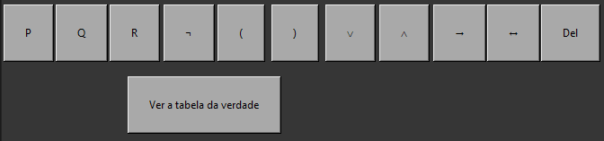
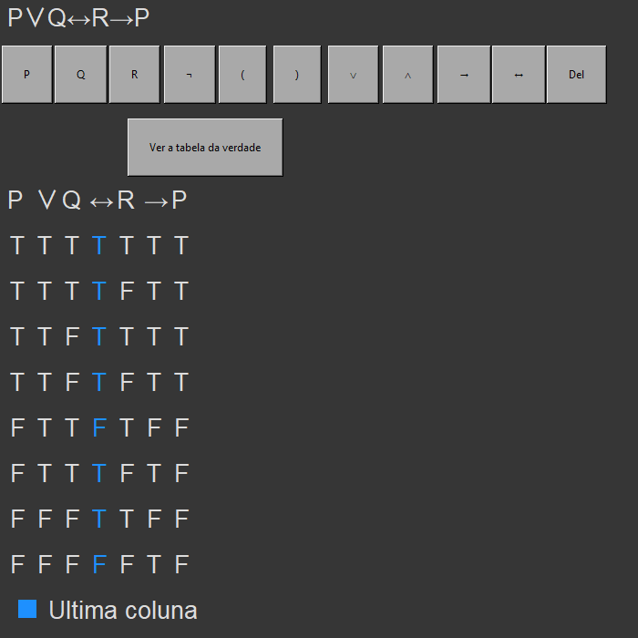

# Resolve FMI

### Programa que resolve questões da disciplina Fundamentos Matematicos da Informatica

## Como usar:

Coloque a fórmula apartir dos botões.

Depois é só apertar em "Ver a tabela da verdade".

A ultima coluna é o último cálculo feito, ou seja é resposta da fórmula.